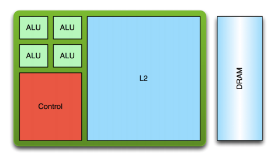
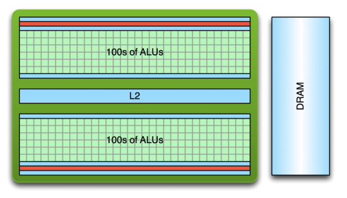
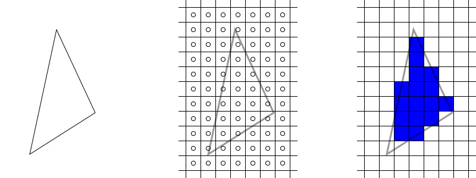
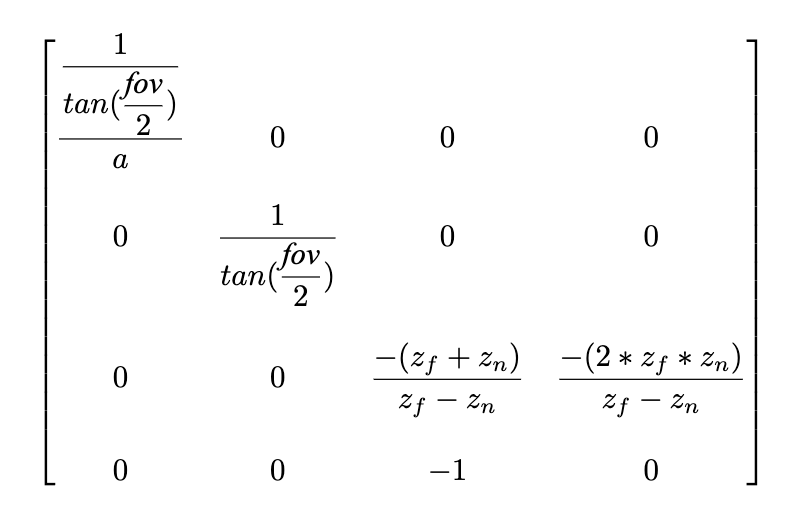
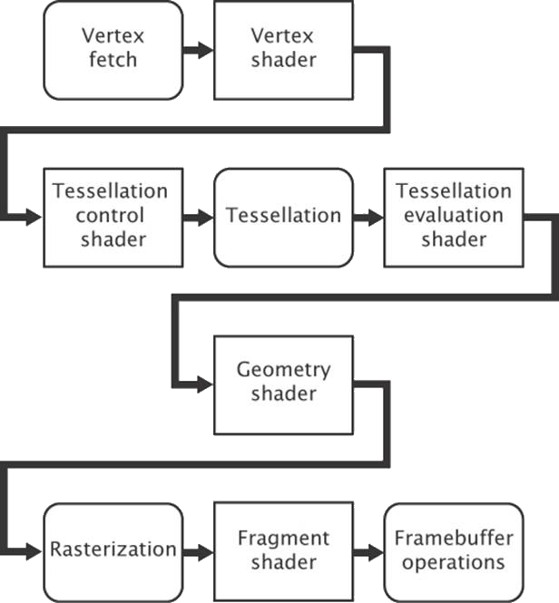

import cube from "./opengl/img/textured-cube.mp4";

This is an adaptation of my senior [seminar paper](https://github.com/shepherdjerred-homework/seminar-paper), originally written in LaTeX. You can view the original [here](/public/opengl.pdf).

## Table of Contents

## Introduction

Computer graphics is an essential component to any consumer facing computer. Efficiently rendering computer graphics requires the use of specialized hardware in the form of graphics processing units. GPUs work differently than the CPUs which programmers are experienced with. This difference is due to the GPUs approach to parallelization. Graphics APIs have been created to help programmers write performant and portable code for GPUs. This post will introduce the core concepts of 3D graphics rendering and OpenGL, a popular and widely-supported graphics API.

Computers have become widespread and have touched many aspects of modern-day life. From new forms of entertainment such as video games to artificial intelligence, they have revolutionized the way to work, learn, and play. Computer graphics in particular have been a driving force behind the adoption of computers because they allow users to easily interact with computers. Programmers use computer graphics to display user interfaces, render video games, and even animate entire films. Every day millions of people interact with interfaces on phones, laptops, and other devices that allow them to focus on the work they are doing rather than how they communicate with their device.

Plenty of tools to manipulate 2D and 3D graphics already exist, such as: 3D object editors, image processing applications, UI libraries, and game engines. These tools allow programmers to quickly get work done, but they may not know how their work is being accomplished. Without this understanding it may be harder for the programmer to debug or optimize their code. By learning the lower-level concepts of computer graphics, one is able to better use higher-level abstractions and tools.

This paper intends to introduce the reader to the broad concepts of graphics processing. This includes the purpose of graphics processing units, why graphics APIs exist, and an introduction to a commonly used cross-platform graphics API --- OpenGL. OpenGL will be discussed so that the reader has an overview of the concepts of OpenGL and can create an OpenGL program. This paper will focus on the use OpenGL version 3.2 which is widely supported and is very similar to the most recent version of OpenGL, which is 4.7.

## Background

Computer graphics is predisposed towards parallel processing due to the repetitive and independent nature of the calculations that it requires (p.~4, sellers2016). Graphics processing units (GPUs) were created in order to meet the unique hardware requirements of computer graphics and are fundamentally different from more traditional central processing units (CPUs). While CPUs generally have a few very fast cores, GPUs take another approach by having a large number of slow cores. Figure 1 illustrates this difference in architecture. It shows the massive difference in arithmetic logic units (ALUs) between CPUs and GPUs. These ALUs give GPUs an edge over CPUs when performing mathematical operations and are a core part of the parallel processing capability that GPUs possess.

<figure>
   
  <figcaption>Figure 1, a comparison of typical CPU and GPU architectures (larkin2016).</figcaption>
</figure>

A difference also exists between the two in their approach to threading. An application running on a CPU may generally have only few threads running due to the high cost of creation and context switches. GPUs have lower cost thread creation and can more quickly context switch, and they often require tens of thousands of threads in order to fully reach their processing potential (larkin2016). Despite the slower performance of an individual GPU core, GPUs easily outperform CPUs in tasks related to graphics processing due to their parallel processing capabilities. Figure 2 shows the historical theoretical performance gap between CPUs and GPUs in giga floating-point operations per second (GFLOP/s), which is a common measure of graphical computation speed. The graph shows that GPUs have a clear performance advantage, with the gap becoming exponentially larger as time goes on.

<figure>
  
  <figcaption>
    Figure 2, a performance comparison of CPUs and GPUs in theoretical peak GLFOP/s over 14 years (galloy2013).
  </figcaption>
</figure>

Using GPUs effectively is especially important when rendering user interfaces, which generally should remain responsive at all times. Because of the architectural differences between GPUs and CPUs, GPUs are programmed differently than CPUs so that their peak performance can be reached. In addition to writing high-level code which is compiled into assembly, GPUs are also programmed by using APIs that are exposed by the manufacturer of the graphics card. GPU manufacturers may support proprietary APIs which is very common on cards that are made to be used in systems such as game consoles and arcade machines, or they may implement standardized APIs such as OpenGL, Metal, Vulkan, or DirectX.

While using a proprietary API may allow a programmer to get more performance out of the hardware they are targeting, it will severely limit the application's portability. A program that is written to run on a GPU using OpenGL should be compatible with any other GPU implementing the same version of OpenGL. These APIs help programmers to focus on the code they are writing rather than what hardware the code will be executed on. The APIs are created so that they are at a low enough level that maximum performance can be achieved while also being at a high enough level so that programmers can easily use them (p.~4, sellers2016).

## Graphics Rendering

Computer displays, such as monitors, use a 2D matrix of pixels to display images. The dimensions of this matrix are referred to as the display's resolution. Traditionally each pixel of a color display has a red, blue, and green value, which together determine the color of the pixel. Graphics rendering is how the color of these pixels are determined so that objects such as text, images, and user interfaces can be conveyed (mckesson2018). The higher the resolution of a display the more detail that can be shown on elements that are drawn. For reference, displays commonly range from standard HD at 1280x720, to very high resolutions such as 3840 x 2160, referred to as 4K. Standard HD is becoming less common while 4K is slowing gaining market share, especially on high-end monitors, TVs, and other consumer electronics.

Graphics rendering is done by positioning primitives such as points, lines, and triangles in a 3D space. After these primitives are defined, their locations are transformed, and they are drawn on the screen through a process called rasterization (mckesson2018). Figure 3 shows a simple example of the rasterization process. The figure begins by defining a triangle primitive which is composed of three 3D vectors. The rasterizer then determines which fragments the triangle overlaps through a process called scan conversion. One way to do this is to include pixels if their centers are contained within the element. Rasterization then produces list of fragments. A fragment is an element that contributes to the final color of a pixel (sellers2016). The fragments are assigned a color in later steps of the rendering process, which may be changed even further in the process when effects such as lighting are taken into account.

Although these three primitives may seem simple and insignificant, they are actually the backbone of graphics rendering. Complex 3D models such as those shown in video games are really just meshes of many small, connected triangles. Squares and other quadrilaterals can be created by connecting two triangles together at their hypotenuses.

<figure>
  <div class="bg-white"></div>
  <figcaption>Figure 3, a visualization of how a single 2D triangle is rasterized (mckesson2018).</figcaption>
</figure>

### Matrices

A two-dimensional object can be drawn by simply defining its x and y coordinates. Three-dimensional objects will not be drawn correctly because the z coordinate does not affect the size of the object. The z coordinate represents how close a point is to a viewer with larger numbers being closer, therefore as the z coordinate increases the object should increase in size as well. This can be fixed by using a projection matrix and matrix multiplication. A projection matrix effects what is visible on the screen, and how it is projected onto it (sellers2016). Each (x, y, z, w) coordinate will be multiplied by a 4x4 matrix, with the result being the location of the coordinate when projected onto the display.

Before the matrix can be created, the aspect ratio, field of view (FOV), z-near, and z-far variables must be determined. The aspect ratio is equal to a display's width in pixels divided by its height in pixels. z-near and z-far represent the closest and furthest possible z coordinate values respectively. The FOV is the angle of the scene that will be rendered on the screen. Figure 4 illustrates of these four variables. Figure 5 shows an example of a 4x4 projection matrix used for 3D rendering. Orthogonal projection matrices exist for 2D rendering however they are outside of the scope of this paper.

<figure>
  
  <figcaption>
    Figure 4, projection matrix concepts (hernandez2019). The camera represents the position of the viewer.
  </figcaption>
</figure>

<figure>
  
  <figcaption>
    Figure 5, a projection matrix where a is the aspect ratio, `fov` is the field of view, `z_f` is z-far, and `z_n` is
    z-near (hernandez2019).
  </figcaption>
</figure>

While a projection matrix defines how all rendered geometry appears, a model matrix can be used to transform individual elements. Like a projection matrix, a model matrix is a 4v4 matrix. It is used to translate, rotate, and scale individual objects on the screen. Model matrices are very important in 3D rendering, as they allow objects to be positioned precisely in scenes without having to manually calculate vertex locations. Like the projection matrix, the model matrix is applied by multiplying the position of each vertex by the matrix. The result is the new position of the vertex with translation, rotation, and scaling applied.

## OpenGL

OpenGL is both a specification and a graphics API which is commonly implemented on modern graphics cards. The specification defines how the use of API should affect the graphics card. Like other graphics APIs, this allows users to use the underlying graphics hardware portably. OpenGL's development began at a computer hardware manufacturer named Silicon Graphics Inc. (SGI). SGI created its own proprietary graphics API named IrisGL which was used on its workstations and graphics hardware. IrisGL was cleaned up and formalized into OpenGL. The first version of OpenGL was released to the public as version 1.0 in 1992 (openglwiki2018). This initial version has been revised many times, with the latest version being 4.6, which was released on July 31st, 2017 (openglwiki2018).

API bindings exist for C/C++ off of which all other language bindings are based (openglwiki2018). Bindings exist for a wide variety of other languages such as python, C#, and LISP and for every major operating system (openglwiki2018). The Lightweight Java Game Library (lwjgl) is a popular Java library that provides bindings for the OpenGL API and it will be used for example in this paper.

Before OpenGL can be used, an OpenGL context (i.e. a desktop window) must be created. Many libraries exist to do this in a cross-platform manner. One popular library that is bundled with lwjgl is the Graphics Library Framework (GLFW), which makes it very easy to create an OpenGL context with lwjgl. Figure 6 shows the code necessary to initialize the GLFW framework, create an operating system window with GLFW, and then finally bind an OpenGL context to the window for drawing. Now that a window and OpenGL context have been created, OpenGL methods can now be called, and the window is ready for drawing.

<figure>
    ```java
    // Initialize GLFW
    glfwInit();

    // Create a new window with a given width, height, and title
    long window = glfwCreateWindow(300, 300, "Hello World!", NULL, NULL);

    // Set the newly created window at the current OpenGL context
    glfwMakeContextCurrent(window);

    // Show the window
    glfwShowWindow(window);

    // Creates OpenGL bindings using the current context
    GL.createCapabilities();
    ```

  <figcaption>Figure 6</figcaption>
</figure>

## VBOs, VAOs, and Uniforms

OpenGL provides the standard primitives used in graphics rendering --- points, lines, and triangles. All of these primitives are represented as float arrays which can be passed to OpenGL for rendering. These float arrays are stored in vertex buffer objects (VBOs). VBOs are used to allocate memory on graphics hardware and are bound along with other objects to vertex array objects (VAOs). Creating a VBO with OpenGL is a simple task, but it would be beneficial to understand how the OpenGL APIs work before going further into the subject.

The OpenGL API has state that is shared globally, which includes what vertex array objects and vertex buffer objects are currently bound. Communication between the CPU and GPU is relatively slow so it should be minimized. Minimizing communication is done by buffering data to be drawn ahead of time and reusing the buffered data whenever possible. Due to the limitations of the Java Virtual Machine (JVM) all memory being shared with native libraries must be allocated off of the JVM heap (lwjglwiki). lwjgl provides utilities to easily allocate this memory through the MemoryStack class. Data created on this stack can be sent to the graphics hardware with lwjgl. Unsigned integers, referred to as names, are used to uniquely identify OpenGL elements such as VBOs and VAOs. Many OpenGL functions take these names as arguments or rely on the currently bound VBO or VAO.

Figure 7 shows the code needed to store the vertices of a triangle on a graphics card. Line two asks OpenGL to create a new buffer name and store it. Next that buffer is bound so that all subsequent operations that require an array buffer will use it. An array of floats representing the vertices of a triangle are created, stored in native memory, and the finally transferred to the graphics card on line 22. A VBO is now stored on the graphics card, but a VAO must first be created and bound before the VBO can be used.

<figure>
    ```java
    // Create a VBO and store its name
    glVboName = glGenBuffers();

    // Bind the VBO created in the last step
    glBindBuffer(GL_ARRAY_BUFFER, glVboName);

    float[] vertices = new float[]{
        0.0f, 0.5f, 0.0f,
        -0.5f, -0.5f, 0.0f,
        0.5f, -0.5f, 0.0f
    };

    try (var stack = MemoryStack.stackPush()) {
        // Allocate a native buffer to store the vertices
        var vertexBuffer = stack.mallocFloat(vertices.length);

        // Put the previously declared vertices into the float buffer
        vertexBuffer.put(vertices);
        vertexBuffer.flip();

        // Send the vertices to the graphics hardware
        glBufferData(GL_ARRAY_BUFFER, vertexBuffer, GL_STATIC_DRAW);
    }
    ```

  <figcaption>Figure 7</figcaption>
</figure>

A vertex array object stores state so that drawing can be done quickly and is required to be created before anything can be drawn. A VAO is bound and then set up so that when an object needs to be drawn in the future it only needs to be rebound without any further instruction before drawing. A vertex array simply keeps pointers to buffers which can and should be bound to multiple VAOs to save memory on the graphics hardware. Figure 8 shows the relationship between vertex array objects and vertex buffer objects. Notice how the VAO has what is essentially an array of pointers to buffers. OpenGL allows you to set the pointer at each index to buffers that contain information about what is being drawn. Vertex buffer objects often contain vertex position coordinates, but they can contain other data used to render the element such as color and texture data.

<figure>
  
  <figcaption>Figure 8, two VAOs with one VBO each (devries2019).</figcaption>
</figure>

As shown in Figure 9, creating a VAO is similar to creating a VBO. The glGenVertexArrays method allocates space for a VAO on the graphics card and returns its name. The name is then bound with the glBindVertexArray method so that all future methods that require a bound VAO use the newly created VAO. The previously created VBO is rebound on line 8 to ensure that the VAO points to the correct VBO. Line 11 sets the 0th index of the bound VAO to the currently bound VBO object. Its other arguments define the size, type, and layout of the data. The last step is to enable the 0th index on the VAO --- otherwise OpenGL will not pass the buffer when rendering.

<figure>
    ```java
    // Create a VAO and store its name
    glVaoName = glGenVertexArrays();

    // Bind the VAO that was just created
    glBindVertexArray(glVaoName);

    // Bind the previously created VBO
    glBindBuffer(GL_ARRAY_BUFFER, glVboName);

    // Have the first VAO index point to the bound VBO
    glVertexAttribPointer(0, 3, GL_FLOAT, false, 0, 0);

    // Enable the first VAO index
    glEnableVertexAttribArray(0);
    ```

  <figcaption>Figure 9</figcaption>
</figure>

VAOs cannot bind more than 4 elements of a VBO array, making it hard to pass large amounts of data to shaders while rendering. Buffers also must be set per VAO which can make code repetitive if some buffer is shared between many VAOs. Uniforms are a type of variable which aim to solve this problem. Uniforms can store not only vectors, but also matrices. They are intended for use where data is common between several elements. Figure 10 shows a uniform being created to store a 4x4 projection matrix.

<figure>
    ```java
    // Create a new perspective matrix
    var matrix = new Matrix4f().perspective(FIELD_OF_VIEW, aspectRatio, Z_NEAR, Z_FAR);

    // Get the name of the matrix
    glUniformName = glGetUniformLocation(glShaderProgramName, "projectionMatrix");

    // Move the matrix to native memory, and then buffer it
    try (MemoryStack stack = MemoryStack.stackPush()) {
        FloatBuffer fb = stack.mallocFloat(16);
        matrix.get(fb);
        glUniformMatrix4fv(glUniformName, false, fb);
    }
    ```

  <figcaption>Figure 10</figcaption>
</figure>

### Indexed Rendering

Consider the case of drawing a square. This would require two right triangles of equal dimensions, each connected at their hypotenuses. Each triangle would only have one unique coordinate, with the other two being shared at the hypotenuses. Right now, this would have to be sent as six coordinates as show in Figure 11, instead of only four. While these two extra coordinates may seem insignificant, this inefficient use of graphics memory may cause problems, especially when rendering complex scenes with hundreds or thousands of triangles. This problem can be solved with indexed rendering.

Indexing adds a layer of indirection when rendering. Rather than directly passing the coordinates to draw to OpenGL, a list of indices is passed. OpenGL then uses this list to access the true data in its buffers. The code to create an element buffer is very similar to that of creating VAOs and VBOs, so it will be omitted. Instead, a comparison of the data being passed to OpenGL will be provided.

The figure below shows a comparison of the code to draw a square with and without indexing. Notice how on Figure 12 each vertex is defined once, and then the vertices used for each triangle is defined in a separate array. The numbers in the indices array represents which index in the vertices array should be used when drawing. For example, the value 0 in the indices array refers to the 0th entry in the vertices array, which is the top-left vertex.

Creating a square without indexing.

<figure>
    ```java
    float[] vertices = new float[]{
        // Format: x, y, z
        // Triangle one
        0.0f, 0.0f, 0.0f, // Top left
        0.0f, -1f, 0.0f,  // Bottom left
        1f, 0.0f, 0.0f,   // Top right
        // Triangle two
        0.0f, -1f, 0.0f,  // Bottom left
        -1f, -1f, 0.0f,   // Bottom right
        0.0f, -1f, 0.0f   // Top right
    };
    ```

  <figcaption>Figure 11, creating a square without indexing.</figcaption>
</figure>

<figure>
    ```java
    float[] vertices = new float[]{
        0.0f, 0.0f, 0.0f, // Top left
        0.0f, -1f, 0.0f,  // Bottom left
        1f, 0.0f, 0.0f,   // Top right
        -1f, -1f, 0.0f,   // Bottom right
    };

    int[] indices = new int[] {
        0, 1, 2, // Triangle One
        0, 2, 3 // Triangle Two
    };
    ```

  <figcaption>Figure 12, creating a square with indexing.</figcaption>
</figure>

## The Rendering Pipeline

Now that a VAO and VBO have been created, OpenGL is almost ready to draw. The only thing left to do is to tell OpenGL what to do with the data it receives from VAOs, VBOs, and uniforms. When OpenGL receives a draw command, it runs the VAO through a pipeline in order to determine what to draw and how to draw it. This pipeline is responsible for positioning, rasterizing, and coloring primitives. The pipeline is divided into several stages, many of which are configurable through programs written in the OpenGL shading language (GLSL). Figure 13 shows a simplified view of the OpenGL pipeline and Figure 14 shows how the input is transformed throughout the pipeline. While OpenGL allows several of its stages to be programmed or configured by the user, some of the stages are fixed-function, meaning that OpenGL does not allow any customization to the stage. A couple of notable fixed-function stages include the vertex fetch stage, the primitive assembly stage, and per-sample processing. The vertex fetch stage is the first stage in the pipeline and feeds the pipeline with data from VAOs and VBOs. The primitive assembly stage performs an optimization known as face culling to ensure that only visible triangles are processed. Per-sample processing is the final stage in the OpenGL pipeline and ensures that previously drawn elements are not overwritten unless the new element's depth is higher through a process called depth testing and writes fragments to the framebuffer to be displayed.

While there are several configurable stages in the pipeline, only two must be defined for rendering to occur. These two stages are the vertex shader and fragment shader. The vertex shader tells OpenGL where a primitive is located, while the fragment shader contributes to the final color of a primitive during rendering.

<figure>
  
  <figcaption>
    Figure 13, a simplified OpenGL pipeline (sellers2016). Boxes with square corners are programmable by the user.
  </figcaption>
</figure>

<figure>
  <div class="bg-white"></div>
  <figcaption>Figure 14, visualization of data flowing through the OpenGL pipeline (overvoorde2019).</figcaption>
</figure>

In order to customize the OpenGL pipeline a shader program must first be created. Once it is created, shaders can be compiled, attached to the program, and then linked. This final executable is run on the graphics hardware and executed by OpenGL when rendering. Figure 15 shows the code needed to create an OpenGL shader program.

<figure>
    ```java
    // Create IDs for a shader program and vertex shader
    glShaderProgramName = glCreateProgram();
    glVertexShaderName = glCreateShader(GL_VERTEX_SHADER);

    // Associate the shader with a string containing its source code
    glShaderSource(glVertexShaderName, vertexShaderSource);

    // Compile the stored source for the shader
    glCompileShader(glVertexShaderName);

    // Associate a shader with a shader program
    glAttachShader(glShaderProgramName, glVertexShaderName);

    // Create an executable from the attached shaders
    glLinkProgram(glShaderProgramName);

    // Set OpenGL to use the shader program when rendering
    glUseProgram(glShaderProgramName);
    ```

  <figcaption>Figure 15</figcaption>
</figure>

### Writing Shaders

As mentioned before writing shaders is done in the OpenGL shading language which is based off of C. Figure 16 shows a simple vertex shader program. The first line declares the version of OpenGL that the shader is using which is OpenGL 3.3 for this shader. Lines starting with "layout" tell OpenGL what input the shader is expecting. In this case this shader expects two inputs --- vectors of size 3 and size 4. The location indicates which index of the VAO these vectors should be found. The 0th index was set in Figure 16 and represents the position of the element. The creation of the 1st index was omitted for brevity, however as the shader program shows it represents the color of the element. Lines starting with "out" indicate what data this shader passes on to future stages in the pipeline. Uniforms are global variables set. This shader contains only one uniform which is a 4x4 projection matrix.

The main function is where the work is being done. gl_Position is a special variable that tells OpenGL the final position of an element. It is assigned to the input position after it is multiplied by the projection matrix. This position is passed on, as well as the color that was passed to the shader.

<figure>
    ```glsl
    #version 330 core

    // A vector of 3 floats at index 0 of the VAO
    layout (location = 0) in vec3 position;

    // A vector of 4 floats at index 1 of the VAO
    layout (location = 1) in vec4 inColor;

    // Output a vector of 4 floats
    out vec4 color;

    // A global 4x4 matrix
    uniform mat4 projectionMatrix;

    void main() {
        // Transform the position of the vertex by the projection matrix
        gl_Position = projectionMatrix \* vec4(position, 1.0);

        // Pass the color to the fragment shader
        color = inColor;
    }
    ```

  <figcaption>Figure 16</figcaption>
</figure>

The fragment shader partially determines the color of pixels. Figure 17 shows a basic fragment shader which receives a color from the vertex shader in Figure 16 and outputs the color as-is.

<figure>
    ```glsl
    #version 330 core

    // A vector of 4 floats in
    in vec4 color;

    // A vector of 4 floats out
    out vec4 outColor;

    void main() {
        // Set the outgoing color to the incoming color
        outColor = color;
    }
    ```

  <figcaption>Figure 17</figcaption>
</figure>

### Textures

Textures allow images to be stored and used while rendering. While OpenGL supports many kinds of textures, only standard 2D textures will be covered here. The process for creating a texture follows the same pattern as VBOs. A texture name must first be created and bound, and then data can be loaded into the texture. This code is show in Figure 18. Once the texture is initialized, it can be used in a fragment shader.

The fragment shader uses a special kind of uniform type called a sampler. Samplers represent textures in shaders (sellers2016). The fragment shader uses a special function called `texture`, which takes a sampler and a coordinate. The coordinate represents where in the texture image the fragment should get its data from. In example 19 the shader receives the coordinate from the vertex shader.

<figure>
    ```java
    // Create and bind a texture
    glTextureName = glGenTextures();
    glBindTexture(GL_TEXTURE_2D, glTextureName);

    // Load a texture into the bound texture buffer
    glTexImage2D(GL_TEXTURE_2D,
        0,
        GL_RGBA,
        width,
        height,
        0,
        GL_RGBA,
        GL_UNSIGNED_BYTE,
        imageData);
    ```

  <figcaption>Figure 18, creating a texture buffer and loading image data into it.</figcaption>
</figure>

<figure>
    ```glsl
    #version 330 core

    vec2 textureCoord;

    out vec4 outColor;

    // Uses the bound texture
    uniform sampler2D textureSampler;

    void main() {
        outColor = texture(textureSampler, textureCoord);
    }
    ```

  <figcaption>Figure 19, loading texture data in the fragment shader.</figcaption>
</figure>

## Conclusion

With all of these concepts a basic OpenGL program can be created. Figure 20 shows a program (Full program source available [here](https://github.com/ShepherdJerred-homework/seminar-application)) that renders a simple textured cube that rotates. It uses all of the previously covered material, and most of the code samples used above. While this program is simple, it composes many concepts and lays the foundation for more complex applications. Games can be created with only these concepts. The only further work with graphics would be to render more elements and make the objects more complex.

<figure>
  <video controls>
    <source src={cube} type="video/mp4" />
  </video>
  <figcaption>Figure 20, a spinning textured cube.</figcaption>
</figure>

Computer graphics are crucial to providing easy-to-use experiences for users, and in creating modern day entertainment and other visual media. OpenGL allows you to render graphics by writing simple shader programs and feeding the OpenGL pipeline with input data. This data can then efficiently be rendered and displayed on-screen to users. The pipeline can transform input and allows programmers to modify how their input is rendered. While there is a lot of overhead in graphics rendering, it allows the user to get the most out of their graphics hardware.

## References

```bibtex
@misc{hernandez2019,
    author = "Antonio Hernández Bejarano",
    title = "Lwjglgamedev",
    url = "ahbejarano.gitbook.io/lwjglgamedev/",
}

@misc{devries2019,
    author = "Joey de Vries",
    title = "Learn OpenGL",
    url = "learnopengl.com/"
}

@misc{galloy2013,
    author = "Michael Galloy",
    title = "CPU vs GPU Performance.",
    url = "michaelgalloy.com/2013/06/11/cpu-vs-gpu-performance.html"
}

@misc{larkin2016,
    author = "Jeff Larkin",
    title = "GPU Fundamentals.",
    url = "www.icl.utk.edu/~luszczek/teaching/courses/fall2016/cosc462/pdf/GPU\_Fundamentals.pdf"
}

@misc{lwjgl,
    author = "lwjgl",
    title = "Lightweight Java Game Library",
    url = "www.lwjgl.org"
}

@misc{lwjglwiki,
    author = "lwjgl wiki",
    title = "Lwjgl Wiki",
    url = "github.com/LWJGL/lwjgl3-wiki/"
}

@misc{masserann2018,
    author = "Arnaud Masserann",
    title = "OpenGL Tutorial",
    url = "www.opengl-tutorial.org/"
}

@misc{mckesson2018,
    author = "Jason L. McKesson",
    title = "Learning Modern 3D Graphics Programming.",
    url = "paroj.github.io/gltut/"
}

@misc{openglwiki2018,
    author = "Khronos",
    title = "OpenGL Wiki",
    url = "www.khronos.org/opengl/wiki/Main\_Page"
}

@misc{overvoorde2019,
    author = "Alexander Overvoorde",
    title = "OpenGL Tutorial",
    url = "open.gl/"
}

@book{sellers2016,
    author = "Graham Sellers, et al.",
    title = "OpenGL Superbible: Comprehensive Tutorial and Reference",
    year = "2016",
    publisher = "Addison-Wesley"
}
```
