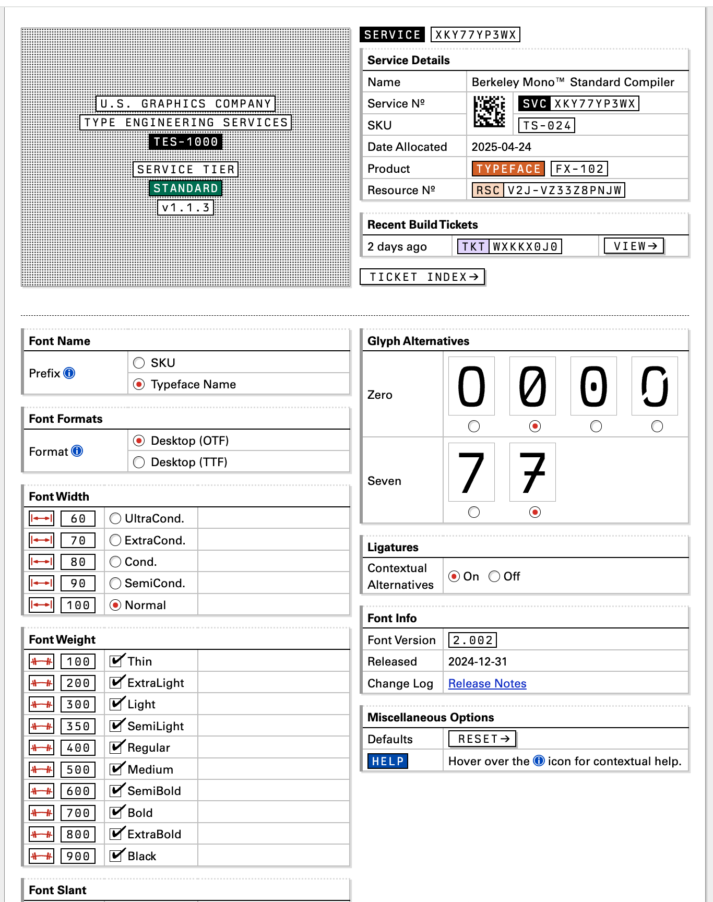

I recently stumbled across [Berkeley Mono](https://usgraphics.com/products/berkeley-mono), a beautiful monospaced font suitable for programming.

The only drawbacks to this font are:

1. It's not free
2. There's no [nerd font](https://www.nerdfonts.com/) version

I'd never paid for a font before, but I was sold after giving the trial version a shot. The font looks amazing and has so many neat features. The way they distribute the font is quite interesting, with a web interface for customizing many aspects of the font.

