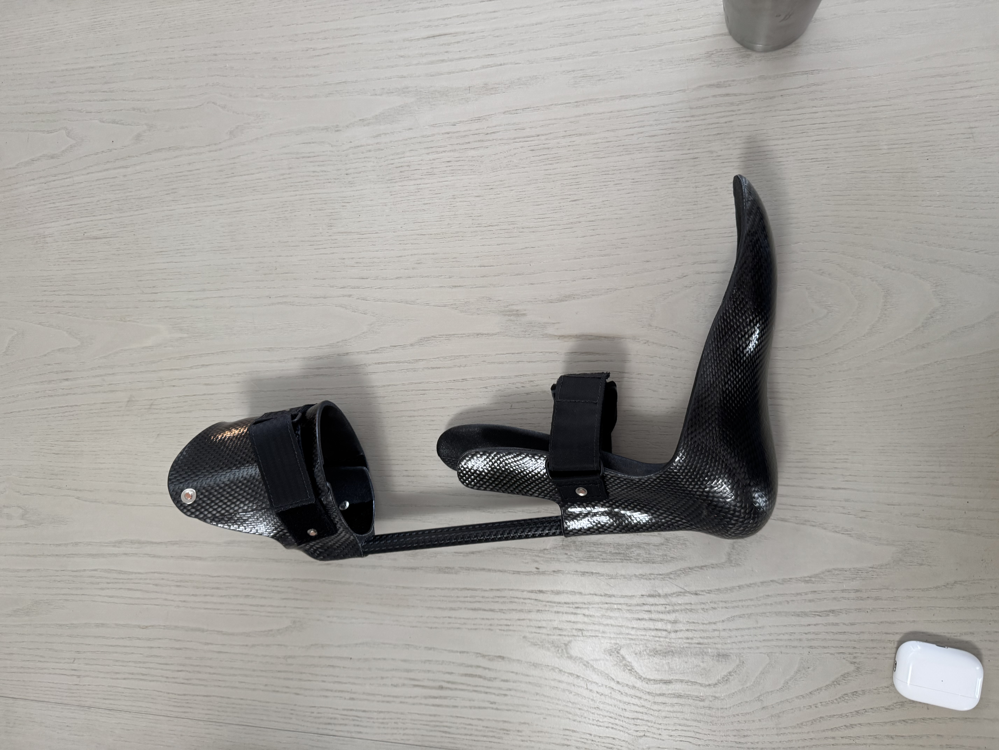
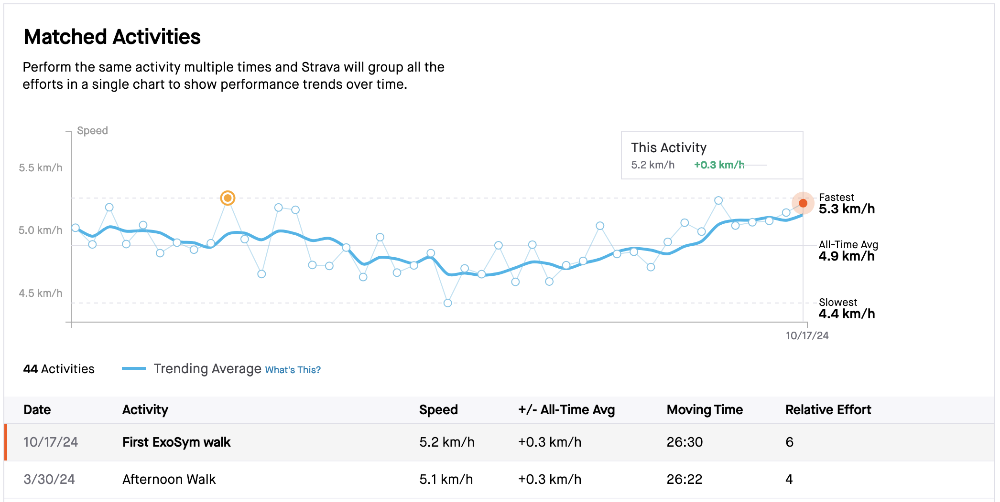

I was born with a [clubfoot](https://en.wikipedia.org/wiki/Clubfoot) on my left side. Clubfoot is a congenital condition that happens in some percent of the population without a clear reason though there seems to be a minor genetic component.

When I was young (as in, a few years old) I had corrective surgery along with other interventions that made my clubfoot more normal, but it still differs in some key ways:

- My left calf is significantly weaker than my right calf. I don't think there's anything wrong with the calf per-se; I think the issue is that it's tough for me to use my left leg effectively so it has gained less muscle. Likewise my right leg has had to compensate for the weakness of my left, so it is stronger than it might otherwise be.
- My left ankle has limited flexibility -- it cannot move left/right at all, and up/down is limited.
- My left foot is two shoe sizes smaller than my right foot.
- My left leg is about one inch shorter than my right left. I've never actually measured this.
- My left ankle hurts after usage, e.g. standing for prolonged periods or walking/running longer distances. I've found that if I walk >15,000 steps that I'll be in significant pain the next day and likely will need to spend the day off my feet.

My left foot & lower leg look normal in isolation, though there are clear differences when you compare it to my (normal) right leg.

I didn't think much about my clubfoot while growing up. I didn't feel particularly embarresed or self-conscious about it. My sister has a term for it -- my lucky fin (in reference to Finding Nemo). Even through college it wasn't something I really thought about much. Occasionally, usually after a long run, a friend or co-worker would ask why I'm limping (or, less politely, someone commented that I "walk weird") and I would explain my condition. To me it's a fact of life and not something that I'm ashamed of or try to hide, though I'm usually not the first one to bring up the subject.

For the most part my clubfoot hasn't significantly affected my activity level. I've been able to run a half-marathon, snowshoe for 10 miles, ski blues, rock climb, lift weights, bike, and so many other things that have interested me over the years.

Running and walking are very important to me. They're how I stay in shape, manage stress/anxiety, and it's something I look forward to in my evenings. I have enjoyed running with friends but that has become much more difficult due to my uncertainty about what I can do without injuring myself.

Everyone begins to lose mobility and feels pain as they age, but I knew that my clubfoot would bring it on prematurely. As an example, my left foot being shorter messes up the alignment of my body which will certainly take its toll down the line.

I'm, of course, thankful that the situation with my clubfoot is mostly more of an annoyance that prevents me from being active. Many with clubed feet (or with other conditions that limit mobility) have chonic pain or were never able to be active at any point in their lives.

I did some physical therapy in middle school, but otherwise I hadn't looked into improving my situation. That changed when my clubfoot started to impact me more. In 2021 I saw a doctor about mild pain in my left knee but that didn't go anywhere. In 2022 my activity began to see a dip -- running became less frequent and for shorter distances. I substituted runs with one hour walks, but that began to wane in 2023. I resumed physical therapy in 2023, but that didn't last long. I felt like I wasn't making any progress and scheduling was a hassle so I stopped scheduling appointments.

--- TODO: post Strava stats/graph showing activity decline

This year I started having significant knee discomfort which led to me stopping my long walks. I've been interested in getting into biking, and so far that has seemed promising, but it hasn't filled my need for running. I've never thought of myself as having a disability, but this year has begun to change that. I definitely am disabled though other's generally don't realize that fact until they see me (and my smaller left calf) in shorts. It's a weird, fundamental shift going from "I'm a regular person" to "there are a lot of things I just cannot do".

Some doctors have been more helpful than others. This year my primary care provider referred me to a wonderful physiatrist. She wasn't able to do much other than to refer me to a get an MRI and see a podiatrist and visit sports medicine clinic. The clinic then referred me to a physical therapist and a orthotics specialist. If you're keeping track that's six referrals in about five months.

It seems like none of my doctors actually know about my clubfeet aside from their general existence. This isn't unreasonable for a profession whose mandate is to know everything about the human body but it is still a bit frustrating that I haven't heard a doctor tell me "I don't know". I've asked for referrals to actual clubfoot specialists but I've yet to actually find a doctor who meets that criteria.

My MRI revealed that I was affected by [runner's knee](https://www.healthline.com/health/runners-knee) on my left side. I'm meant to continue with physical therapy and consult some more specialists. My doctors have been optimistic that I'll be able to run regularly, but I'm honestly quite unsure how a little more physical therapy will solve my problem.

I'm very thankful for the medical system, but it hasn't been able to help me with my club foot recently. I did what any reasonable person would do and turned to the [clubfoot Reddit](https://reddit.com/r/clubfoot/). My research on Reddit yielded two insights:

- Those with clubfeet sometimes refer to themselves at clubbies, which is an adorable term I wish I knew of earlier
- There is a device called [ExoSym](https://hangerclinic.com/blog/featured-technology/hanger-clinic-exosym/) and many on the subreddit reported great success with the device.

There are two obstacles to obtaining an ExoSym device: they're custom made in Gig Harbor, Washington, and the device costs $9,000 (and your insurance probably doesn't cover it).

This is quite a lucky situation for me. I live in Seattle which is only an hour away, and I'm a software engineer who can afford paying $9,000 in the hope that the device will work for me.

The process for receiving a device isn't so complicated. You send in some documentation about your condition including some videos of you walking. Prosthetist Ryan Blanck, the creator of the program, reviews your information and (hopefully) lets you know that ExoSym will work for your condition.

Next you schedule some appointments. One for taking a cast of your leg, another for trying on a plastic "trial" device, and a final appointment for receiving the finished device.

The construction of the device is surprisingly simple. It's essentially a carbon fiber outline of your lower leg with some foam padding and a hinge. I received my finished ExoSym device today and it felt very similar to the plastic "trial" device though much more sturdy and comfortable. Ryan took me on a walk in the device and handed me off to Becki, a physical therapist. In about one hour she helped me go up stairs, ramps, jump up onto an 18 inch platform, and to sprint.

The mechanics of walking in an ExoSym device feels similar to walking in a ski boot, though much more comfortable. This is most obvious when going up/down stairs -- the movements are almost identical for me.

After arriving home with my ExoSym device the first thing I did was go for a short walk. There's a route by my house that I do regularly -- it's roughly 2.5km. I use Strava to record nearly all of the activity I do, so I was able to compare my walk to all of my past efforts.

I expected it to be incredibly slow considering that I had no idea how to use my ExoSym appropriately, but I was surprised to see my pace was 5.2 km/h -- my fastest recorded pace is 5.3 km/h.

Running in an ExoSym is... different. My clubfoot has usually just been along for the ride on my runs -- my right leg does all of the work & my left is just a crutch. Running with a useful left leg makes me feel like Captain America:

<iframe
  width="100%"
  height="500px"
  src="https://www.youtube.com/embed/ObTHnSLt2HU"
  title="Avengers: Infinity War - Captain America and Black Panther outruns everyone/Running Scene [HD] 2018"
  frameborder="0"
  allow="accelerometer; autoplay; clipboard-write; encrypted-media; gyroscope; picture-in-picture; web-share"
  referrerpolicy="strict-origin-when-cross-origin"
  allowfullscreen
></iframe>

It's difficult for me to understand how such a simple device seems to solve my problem. The solution feels too easy. I'm cautiously optimistic. My biggest concern is that I might be trading ankle pain for knee pain. There's really no way for me to find out without trying, though.
