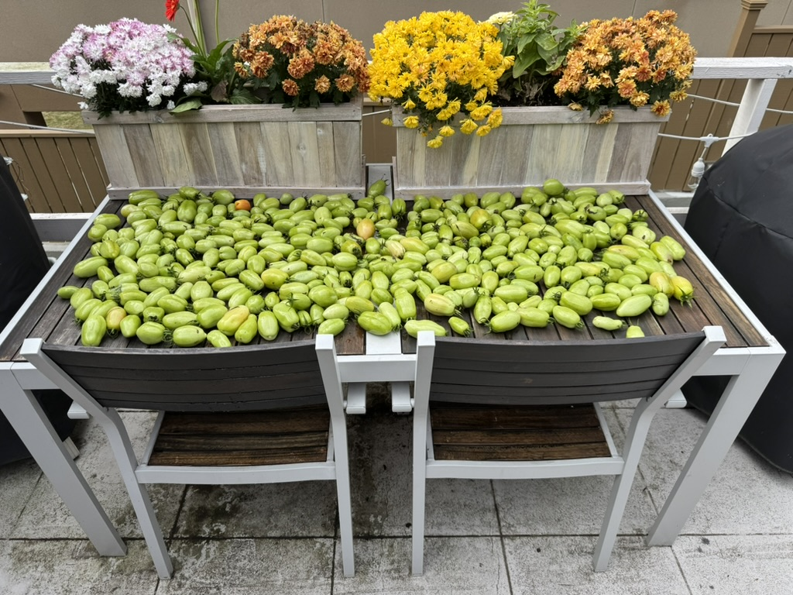

Inspired by <https://sive.rs/now>

## 2024 10 14

- Getting my desk at work setup
  - Finally got my Apple Studio Display! Going to set it up tomorrow :)
- Enjoying the colder weather & getting ready for the winter
- Improving my Home Assistant automations
- Scheduled my kidney donation for 10/30
- Dropped HPCA
- Disposed of 7.5 gallons of moldy tomatoes
  - I really should've done a better job making sure they weren't moist
- Reading Fugitive Telemetry
- Watching season 5 of [The Sopranos](https://en.wikipedia.org/wiki/The_Sopranos)

## Past

### 2024 10 05

- Getting my desk at work setup
  - Really thinking about buying an [Pro Display XDR](https://www.apple.com/pro-display-xdr/)
    - I have the [Studio Display](https://www.apple.com/studio-display/) at home and really like it
- Enjoying the colder weather & getting ready for the winter
- Improving my Home Assistant automations
- Started biking to work
- Somehow working in UWMC on Fridays
- Scheduled my kidney donation for 10/30
- Studying for HPCA midterm
- Finally harvested my garden
  - Roughly 7.5 gallons of green tomatoes and 4 gallons of tomatillos
    - 
  - Also lots of carrots, parsley, scallions, onions, cucumber
  - Giving away most of the above; trying to ripen & can the tomatoes
- Tried out a test version of [ExoSym](https://hangerclinic.com/blog/featured-technology/hanger-clinic-exosym/) and it went well. The full version of it should be ready for me on Tuesday
- Reading [Network Effect](<https://en.wikipedia.org/wiki/Network_Effect_(novel)>)
- Watching season 3 of [The Sopranos](https://en.wikipedia.org/wiki/The_Sopranos)

### 2024 09 21

- Finished up my first week at Pinterest
  - I've had such a great time & I'm really looking forward to contributing
  - My work habits are really changing (for the better!)
- Trying to figure out if I can still volunteer at UWMC on Fridays
- Determining a good time for my kidney donation
  - Maybe in November/December?
- Really behind on lectures for HPCA
- Not sure what to do with an abundance of food I've grown
  - I might try to get into canning tomatoes, but I am very scared of [botulism](https://en.wikipedia.org/wiki/Botulism)
- Looking into improving the situation with my [club foot](https://en.wikipedia.org/wiki/Clubfoot)
  - My goal is to return to running long distances (9+ mi)
  - Treatment right now is going to PT and ~~seeing a podiatrist soon~~
    - I missed my podiatrist appointment (again)
  - Had a cast of of my leg taken for [ExoSym](https://hangerclinic.com/blog/featured-technology/hanger-clinic-exosym/)
    - I'll get to try a test device next week. I'm optimistic!

### 2024 09 10

- Accepted an offer at Pinterest!
  - My first day is September 16th
  - Super excited & looking forward to _finally_ being in office again
  - Also excited to (hopefully) be biking to work again!
- Trying to bike regularly (at least a couple times a week)
- Various projects around my house
  - Finishing up projects I started a year or two ago
    - Painting
    - Replacing outlets
    - Adding new shelves
  - Staining flower boxes
  - Getting a ton of new plants
  - Tracking my energy usage with [Home Assistant](https://www.home-assistant.io/docs/energy/)
- Started the fall semester at Georgia Tech
  - I'm taking [High Performance Computer Architecture](https://omscs.gatech.edu/cs-6290-high-performance-computer-architecture)
- Harvested the first tomatoes from my garden
  - Tomatillos are also starting to look great
- Looking into improving the situation with my [club foot](https://en.wikipedia.org/wiki/Clubfoot)
  - My goal is to return to running long distances (9+ mi)
  - Had an MRI a week or two ago; My left knee suffers from [overuse](https://www.webmd.com/pain-management/knee-pain/runners-knee)
  - Treatment right now is going to PT and seeing a podiatrist soon
  - Also looking into [ExoSym](https://hangerclinic.com/blog/featured-technology/hanger-clinic-exosym/)

### 2024 08 31

- Accepted an offer at Pinterest!
  - My first day is September 16th
  - Super excited & looking forward to _finally_ being in office again
  - Also excited to (hopefully) be biking to work again!
- Painted my living room
  - I bought the paint two years ago & figured it was about time
- Playing Portal 2 on my Steam Deck
- Started the fall semester at Georgia Tech
  - I'm taking [High Performance Computer Architecture](https://omscs.gatech.edu/cs-6290-high-performance-computer-architecture)
- Finished my volunteer training at UWMC

### 2024 08 10

- Getting ready for my Pinterest onsite next week.
  - I'm feeling fairly confident! I've been studying _hard_ for the last 3 months.
- Figuring out if I can attend the [Recurse Center](https://www.recurse.com/).
  - I was accepted a couple of weeks ago. I'm not able to attend Fall 1 (which starts on the 12th), but I might be able to attend Fall 2 (starts Sept 23rd) if I don't get an offer from Pinterest.
- Excited for next semester at Georgia Tech.
  - The semester starts on the 19th. I'll be taking [High Performance Computing Architecture](https://omscs.gatech.edu/cs-6290-high-performance-computer-architecture).
- Doing a _lot_ of memorization with Anki.
  - I'm trying to memorize the periodic table. There's a lot to remember, but I think it'll be mildly helpful!
- Volunteering at UWMC.
- Finishing up [Scrubs](<https://en.wikipedia.org/wiki/Scrubs_(TV_series)>).

### 2024 07 24

- Hunting for a job.
  - So much to do!
    - LeetCoding
    - Studying with Anki
    - Interviewing
    - Applying
  - I'm very thankful for my friends and former coworkers who are helping me out.
- Deferred my kidney donation.
  - Job hunting is very time consuming (especially LeetCode/studying). I just can't risk the downtime of donating right now. I hope to donate in the winter.
- Volunteering at UWMC.
- Started watching [Scrubs](<https://en.wikipedia.org/wiki/Scrubs_(TV_series)>).
- Watching [House of the Dragon](https://en.wikipedia.org/wiki/House_of_the_Dragon) every week.

### 2024 07 01

- Reading _[The Murderbot Diaries](https://en.wikipedia.org/wiki/The_Murderbot_Diaries)_.
  - About to start the fifth book!
- Trying to replace running with biking.
  - Writing this from [Santo](https://maps.app.goo.gl/LWngWqLPh6jEbxCe8), which I biked to.
- Officially approved to donate my kidney!
  - It sounds like it'll be about another month before the donation actually occurs.
- Volunteering at UWMC.
  - I should have my first volunteer day this week.
- Hunting for a job.
  - Working on LeetCode, applying for jobs, etc.
  - I'm very thankful for my friends and former coworkers who are helping me out.
- More gardening, planting, etc.
  - Things are looking great! My tomatillos are a little needy, though.
- Started season 2 of [Who's the Boss](https://en.wikipedia.org/wiki/Who%27s_the_Boss%3F).
  - I have no idea why I'm watching a show from the 80's.
- Watching [House of the Dragon](https://en.wikipedia.org/wiki/House_of_the_Dragon) every week.
  - It's so good!
- Writing some open source libraries:
  - [webring](https://github.com/shepherdjerred/webring)
  - [astro-opengraph-images](https://github.com/shepherdjerred/astro-opengraph-images)
- Getting ready for the Fourth of July
  - I'm planning on smoking some pork & making ice cream.

### 2024 06 24

- Looking forward to doing some cooking & baking for friends.
- Reading _[The Murderbot Diaries](https://en.wikipedia.org/wiki/The_Murderbot_Diaries)_.
  - Waiting on the 4th book to come in.
- Trying to replace running with biking.
  - I'm writing this from [Holy Mountain Taproom](https://maps.app.goo.gl/mDssmTL6TXGLhjbG9), which I biked to
- Officially approved to donate my kidney!
  - It sounds like it'll be about another month before the donation actually occurs.
- Volunteering at UWMC.
  - I picked up my badge last week.
- Hunting for a job.
  - Working on LeetCode, applying for jobs, etc.
  - I'm very thankful for my friends and former coworkers who are helping me out.
- More gardening, planting, etc.
- Starting season 2 of [Who's the Boss](https://en.wikipedia.org/wiki/Who%27s_the_Boss%3F).
- Working on small side projects like this blog.

### 2024 06 18

- Looking forward to doing some cooking & baking for friends.
- Reading _[The Murderbot Diaries](https://en.wikipedia.org/wiki/The_Murderbot_Diaries)_.
  - I'm on book 3 and I'm really enjoying it.
- Trying to replace running with biking.
- Officially approved to donate my kidney!
- Picking up my UWMC badge this week!
- Hunting for a job
  - Working on LeetCode, applying for jobs, etc.
  - I'm very thankful for my friends and former coworkers who are helping me out.
- Refinished my outdoor furniture. I got lazy towards the end, but it still looks pretty good.
- Dredging up my [game engine](https://github.com/shepherdjerred/castle-casters). I've fixed a few old bugs an I'm wanting to make the game playable.
- Still not sure what to do with my cilantro and lettuce. Maybe I'll let the cilantro turn into coriander seed?

### 2024 06 15

- Reading _[The Murderbot Diaries](https://en.wikipedia.org/wiki/The_Murderbot_Diaries)_.
  - I'm on book 3 and I'm really enjoying it.
- Trying to replace running with biking.
- Awaiting hearing back from the donor committee.
- Picking up my UWMC badge this week!
- LeetCode!
- Refinished my outdoor furniture. I got lazy towards the end, but it still looks pretty good.
- Dredging up my [game engine](https://github.com/shepherdjerred/castle-casters). I've fixed a few old bugs an I'm wanting to make the game playable.
- Still not sure what to do with my cilantro and lettuce. Maybe I'll let the cilantro turn into coriander seed?

### 2024 06 09

- Reading _[The Murderbot Diaries](https://en.wikipedia.org/wiki/The_Murderbot_Diaries)_.
- Finished up my CGM, things are looking good for the kidney donation!
- Working on my UWMC competencies.
- Starting to LeetCode again.
- Nearly done refinishing my outdoor furniture (next up is painting my living room!).
- Lots of gardening. I have way too much cilantro and lettuce.
- Figuring out how I want to apply my technical expertise.
  - What's the point of learning so many cool things without doing something with that knowledge?
- Enjoying not having school for the summer.

### 2024 05 24

- Reading _A Desolation Called Peace_.
- Donating a kidney. It's looking like I can donate, but we're looking into an episode of hypoglycemia first.
  Which brings me to...
- Wearing a continuous glucose monitor for the next two weeks!
- Starting to volunteer at UW Montlake.
- Enjoying the start of summer. Lots of gardening, yard/lawn maintenance, re-finishing wooden outdoor furniture, and
  spending more time outside.
- Taking the summer off from my Master's at Georgia Tech. I needed a break after taking compilers.
- Therapy.

### 2024 05 23

- Donating a kidney. I just have one more lab test to pass before I'm cleared. I'm hoping to donate in the next month.
- Starting to volunteer at UW Montlake.
- Enjoying the start of summer. Lots of gardening, yard/lawn maintenance, re-finishing wooden outdoor furniture, and
  spending more time outside.
- Taking the summer off from my Master's at Georgia Tech. I needed a break after taking compilers.
- Therapy.
